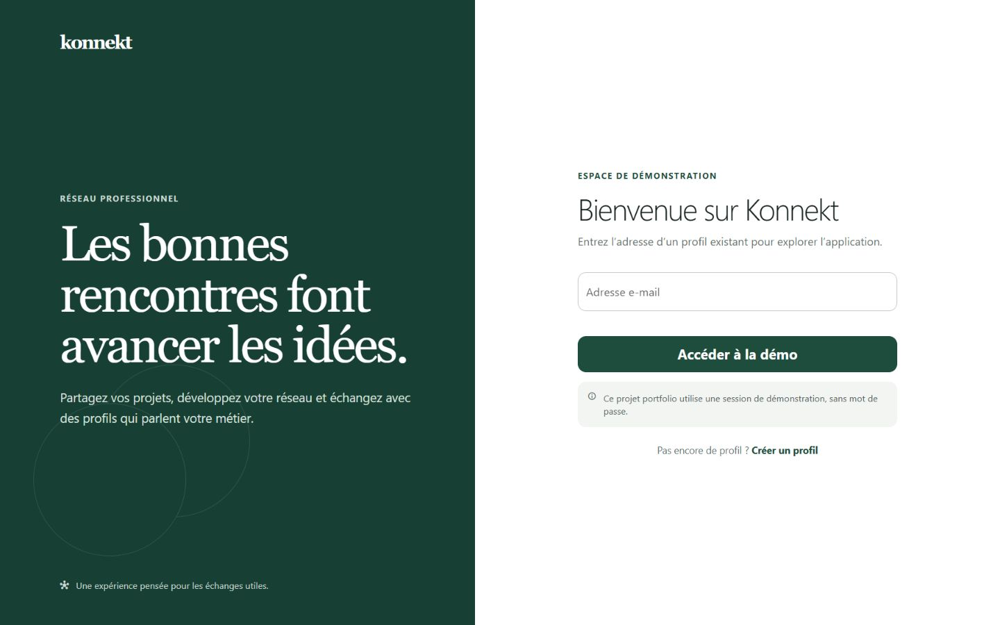
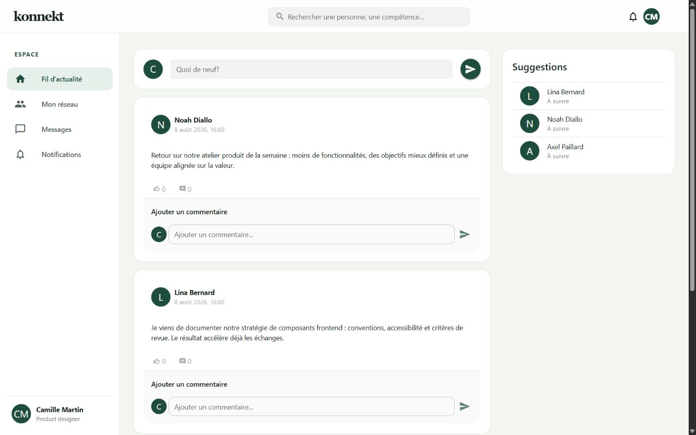
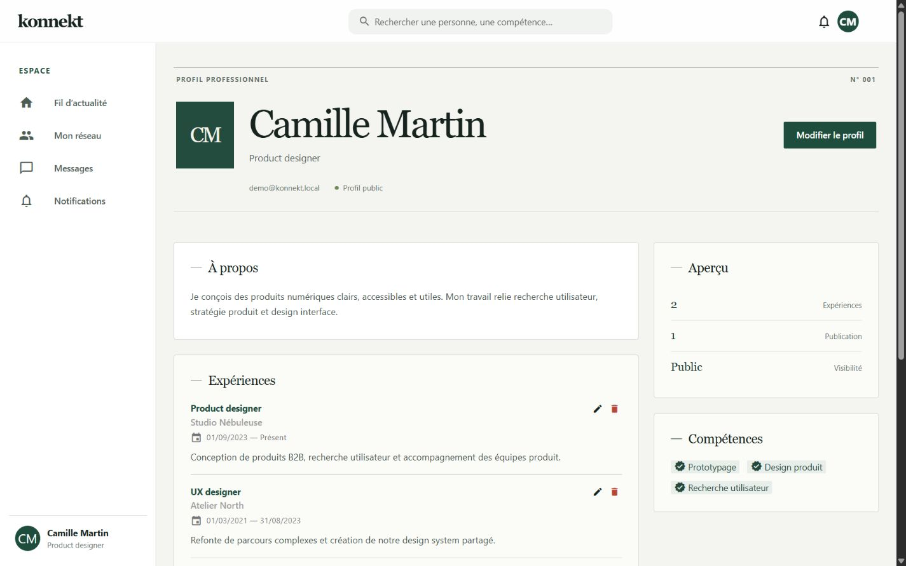

# Konnekt

Konnekt est une plateforme de réseau professionnel full-stack : profils, expériences, compétences, publications, connexions, notifications et messagerie en temps réel.

Le projet a été restructuré en monorepo à partir de deux applications réalisées séparément. Les historiques Git du frontend et du backend sont conservés dans ce dépôt.

## Aperçu



| Fil d’actualité | Profil professionnel |
| --- | --- |
|  |  |

- Fil d’actualité avec publications, commentaires et mentions J’aime
- Profils publics avec expériences et compétences
- Demandes de connexion et suggestions de profils
- Recherche multicritère
- Conversations persistées dans MongoDB
- Notifications et échanges WebSocket
- Interface responsive conçue avec Vue 3 et Quasar
- API REST documentée avec OpenAPI

> **Authentification :** cette version portfolio fonctionne avec une session de démonstration par profil, clairement indiquée dans l’interface. Elle ne prétend pas fournir une authentification sécurisée. Un flux OAuth2/JWT fait partie des évolutions prévues.

## Stack technique

| Couche | Technologies |
| --- | --- |
| Frontend | Vue 3, Quasar, Pinia, Axios, SCSS |
| API | Java 17, Spring Boot, Spring MVC, WebSocket |
| Données relationnelles | MySQL, JPA, Hibernate |
| Données documentaires | MongoDB, Spring Data MongoDB |
| Qualité | ESLint, JUnit 5, Mockito, JaCoCo, GitHub Actions |
| Exécution | Docker, Docker Compose, Nginx |

## Démarrage avec Docker

Prérequis : Docker Desktop avec Docker Compose v2.

```bash
cp .env.example .env
docker compose up --build
```

Sous PowerShell :

```powershell
Copy-Item .env.example .env
docker compose up --build
```

Une fois les services prêts :

- Application : [http://localhost:8080](http://localhost:8080)
- API : [http://localhost:8081/api](http://localhost:8081/api)
- Swagger UI : [http://localhost:8081/swagger-ui/index.html](http://localhost:8081/swagger-ui/index.html)
- État de l’API : [http://localhost:8081/actuator/health](http://localhost:8081/actuator/health)

Arrêter l’environnement :

```bash
docker compose down
```

Pour supprimer également les volumes de développement :

```bash
docker compose down --volumes
```

## Développement local

### 1. Bases de données

Lancer uniquement MySQL et MongoDB :

```bash
docker compose up -d mysql mongodb
```

Les identifiants par défaut correspondent à `.env.example` et peuvent être remplacés dans un fichier `.env` non versionné.

### 2. API

Prérequis : JDK 17 ou supérieur.

```bash
cd apps/api
./mvnw spring-boot:run
```

Sous Windows :

```powershell
cd apps/api
.\mvnw.cmd spring-boot:run
```

L’API écoute alors sur `http://localhost:8080`.

### 3. Frontend

Prérequis : Node.js 22.22 ou supérieur.

```bash
cd apps/web
npm ci
npm run dev
```

Le frontend de développement écoute sur `http://localhost:9000` et utilise par défaut l’API locale sur `http://localhost:8080/api`.

## Vérifications

```bash
# Frontend
npm --prefix apps/web run lint
npm --prefix apps/web run build

# API — Linux/macOS
cd apps/api && ./mvnw test

# API — Windows
cd apps/api; .\mvnw.cmd test

# Valider la configuration Docker Compose
docker compose config
```

## Structure

```text
.
├── apps/
│   ├── api/                 # API Spring Boot
│   └── web/                 # SPA Vue / Quasar
├── docs/
│   ├── screenshots/         # Captures destinées au portfolio
│   └── ARCHITECTURE.md      # Choix techniques et flux de données
├── .github/workflows/       # Intégration continue
├── compose.yaml             # Environnement complet
├── .env.example             # Variables documentées
└── README.md
```

## Configuration

| Variable | Défaut | Description |
| --- | --- | --- |
| `DATABASE_URL` | MySQL local `konnekt` | URL JDBC utilisée par l’API |
| `DATABASE_USERNAME` | `konnekt` | Utilisateur MySQL |
| `DATABASE_PASSWORD` | `konnekt` | Mot de passe MySQL |
| `MONGODB_URI` | MongoDB local `konnekt` | URI de la base documentaire |
| `MONGODB_DATABASE` | `konnekt` | Nom de la base MongoDB |
| `CORS_ALLOWED_ORIGINS` | ports 9000 et 8080 | Origines web autorisées, séparées par des virgules |
| `VITE_API_URL` | `http://localhost:8080/api` | Base URL utilisée par le frontend |

## Architecture

Les données fortement relationnelles (profils, expériences, compétences et connexions) sont stockées dans MySQL. Les contenus à structure documentaire et à croissance rapide (publications, conversations, notifications et feeds) sont stockés dans MongoDB.

Les détails, compromis et pistes d’évolution sont documentés dans [docs/ARCHITECTURE.md](docs/ARCHITECTURE.md).

## Limites connues et feuille de route

- Remplacer la session de démonstration par OAuth2/OIDC ou JWT avec rotation des refresh tokens
- Ajouter des migrations Flyway au lieu de `ddl-auto=update`
- Ajouter des tests end-to-end Playwright
- Ajouter le téléversement d’avatars et de médias vers un stockage objet
- Paginer systématiquement les endpoints de listes

## Auteur

Projet conçu et développé par Axel Paillard dans le cadre d’un exercice d’architecture full-stack, puis remanié pour une présentation portfolio.
