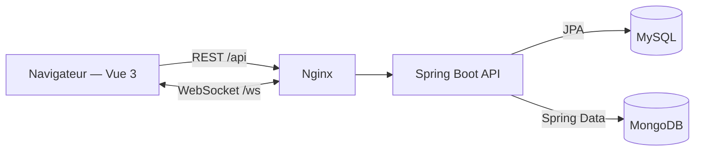

# Architecture de Konnekt

## Vue d’ensemble

Le frontend est une SPA Vue 3 servie par Nginx en production. Nginx sert les fichiers statiques et transmet les routes `/api` et `/ws` à l’API, ce qui évite de coupler le navigateur au nom interne du conteneur backend.

## Répartition des responsabilités

### Frontend

- `pages/` assemble les parcours utilisateur.
- `components/` contient les éléments réutilisables.
- `stores/` porte l’état partagé avec Pinia.
- `services/` isole les appels HTTP et WebSocket.
- `layouts/` définit la navigation responsive et le cadre visuel.

### API

- `controllers/` traduit HTTP vers les cas d’usage.
- `services/` porte les règles métier.
- `repositories/` isole l’accès à MySQL et MongoDB.
- `dtos/` définit les contrats exposés aux clients.
- `models/` contient les entités JPA et documents MongoDB.
- `config/` centralise CORS, MongoDB et WebSocket.

## Persistance polyglotte

MySQL est utilisé pour les relations cohérentes et structurées : profils, expériences, compétences et connexions. MongoDB porte les agrégats documentaires : publications, commentaires, conversations, notifications et feeds.

Cette séparation était une contrainte pédagogique utile pour illustrer deux modèles de données. Dans un produit réel de taille modeste, une base PostgreSQL unique pourrait réduire le coût opérationnel.

## Sécurité

La version actuelle est une démonstration de fonctionnalités sociales. La sélection d’un profil par e-mail crée uniquement une session locale dans le navigateur ; ce n’est pas une authentification. L’interface et la documentation l’indiquent explicitement.

Pour une mise en production, le flux recommandé est OAuth2/OIDC avec un fournisseur d’identité, des cookies `HttpOnly` sécurisés, une protection CSRF adaptée et des règles d’autorisation vérifiées dans les services backend.

## Conteneurs

Docker Compose orchestre quatre services :

1. MySQL et MongoDB démarrent avec des volumes persistants et des healthchecks.
2. L’API attend que les deux bases soient disponibles.
3. Le frontend attend que l’API soit saine.
4. Nginx expose l’application sur un point d’entrée unique.

